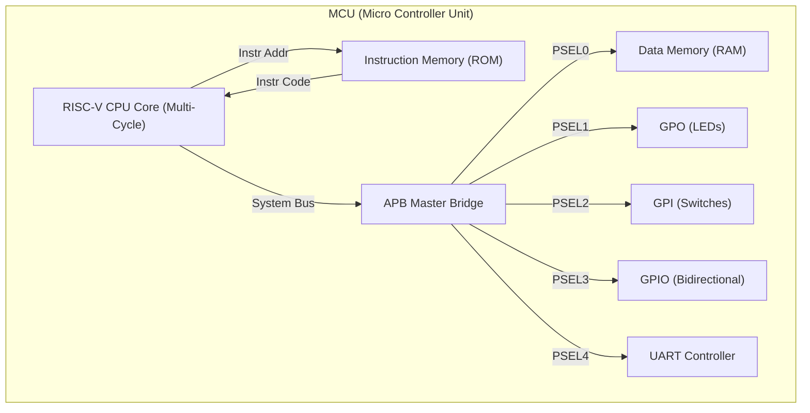
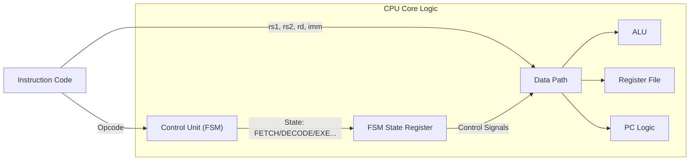

# 🚀 SystemVerilog RISC-V RV32I Multi-Cycle MCU

> **32-bit RISC-V Multi-Cycle CPU Core + APB Interconnect + Peripherals**
>
> FSM 기반의 멀티 사이클 프로세서 설계 및 표준 버스 프로토콜을 적용한 FPGA 임베디드 MCU 시스템

-----

## 📖 1. 프로젝트 개요 (Overview)

이 프로젝트는 SystemVerilog를 사용하여 RISC-V RV32I (Base Integer Instruction Set) 아키텍처를 구현한 프로세서 설계입니다. CPU 코어는 Control Unit과 DataPath로 명확히 분리되어 있으며, 최상위 모듈인 MCU에서 AMBA APB 프로토콜을 통해 메모리 및 다양한 주변장치(UART, GPIO)와 통합되어 실제 임베디드 어플리케이션을 실행할 수 있는 SoC 구조를 갖추고 있습니다.

### ✨ 핵심 설계 특징 (Key Features)

  * **Multi-Cycle Microarchitecture:** FSM을 사용하여 명령어 종류에 따라 가변적인 클럭 사이클(3\~5 Cycles)을 소모하며 실행 효율 최적화.
  * [cite_start]**FSM Based Control:** 14개의 상태(State)를 갖는 제어 유닛이 Datapath의 제어 신호를 순차적으로 관리 [cite: 1037-1050].
  * **Bus System:** 표준 **AMBA APB 3.0 Protocol**을 구현한 Master Bridge를 통해 시스템 확장성 확보.
  * **Peripherals Integration:** UART, GPIO(LED, Switch) 등의 주변장치를 APB 버스에 통합하여 SoC(System on Chip) 구성.
  * **Advanced Verification:** OOP 기반의 트랜잭션 검증 환경을 통해 버스 프로토콜 및 시스템 동작 신뢰성 검증.

-----

## 🏗️ 2. 시스템 아키텍처 (System Architecture)

### 2.1 MCU Top-Level Diagram

CPU는 명령어 인출과 데이터 접근을 위한 버스가 분리되어 있으며(Harvard Architecture), 주변 장치들은 APB Bridge를 통해 제어됩니다.



### 2.2 CPU Internal Microarchitecture (Control & Datapath)

CPU는 상태 머신(Control Unit)의 현재 상태에 따라 ALU, MUX, 레지스터 등을 제어하여 다단계 연산을 수행합니다.



### 2.3 APB Memory Map

`APB_Master` 내부의 디코더(`APB_Decoder`)에 의해 주소 공간이 다음과 같이 할당됩니다.

| Slave Device | Base Address | Description | PSEL Index |
| :--- | :--- | :--- | :---: |
| **RAM** | `0x1000_0000` | 데이터 메모리 (Read/Write) | PSEL0 |
| **GPO** | `0x1000_1000` | 출력 포트 (LED Control) | PSEL1 |
| **GPI** | `0x1000_2000` | 입력 포트 (Switch Input) | PSEL2 |
| **GPIO** | `0x1000_3000` | 범용 양방향 입출력 포트 | PSEL3 |
| **UART** | `0x1000_4000` | 시리얼 통신 (Tx/Rx Data & Status) | PSEL4 |

-----

## 💻 3. 멀티 사이클 상세 동작 명세 (Multi-Cycle FSM Specification)

명령어 실행은 공통 단계(`FETCH`, `DECODE`)를 거친 후, 명령어 타입에 따라 서로 다른 상태 경로를 가집니다.

### 🔄 공통 단계 (Common Stages)

1.  **FETCH:** `PC` 주소에서 명령어를 읽어옵니다. (1 Cycle)
2.  **DECODE:** Opcode를 분석하여 다음 상태(`XXX_EXE`)를 결정하고, 레지스터 파일에서 피연산자를 읽습니다. (1 Cycle)

### 3.1 R-Type (Arithmetic/Logic)

레지스터 간 연산 수행. 총 **3 Cycles** 소요 (`FETCH` → `DECODE` → `R_EXE`).

  * **State Flow:**
      * `R_EXE`: ALU가 연산을 수행하고 결과를 레지스터 파일(`rd`)에 씁니다. 다음 상태는 `FETCH`로 돌아갑니다.
  * **Operations:** `ADD`, `SUB`, `SLL`, `SLT`, `XOR`, `SRL`, `OR`, `AND`.

### 3.2 I-Type (Immediate Arithmetic)

상수 연산 수행. 총 **3 Cycles** 소요 (`FETCH` → `DECODE` → `I_EXE`).

  * **State Flow:**
      * `I_EXE`: 레지스터(`rs1`)와 확장된 상수(`imm`)를 ALU 연산하고 결과를 저장합니다.
  * **Operations:** `ADDI`, `ANDI`, `ORI`, `SLTI` 등.

### 3.3 Load Instructions (I-Type)

메모리 읽기. 가장 긴 경로인 **5 Cycles** 소요 (`FETCH` → `DECODE` → `L_EXE` → `L_MEM` → `L_WB`).

  * **State Flow:**
      * `L_EXE`: 주소 계산 (Base + Offset).
      * `L_MEM`: 메모리(APB Bus) 접근 요청 및 데이터 대기 (`ready` 신호 확인).
      * `L_WB`: 읽어온 데이터를 레지스터(`rd`)에 저장 (Write Back).
  * **Operations:** `LB`, `LH`, `LW`, `LBU`, `LHU`.

### 3.4 Store Instructions (S-Type)

메모리 쓰기. 총 **4 Cycles** 소요 (`FETCH` → `DECODE` → `S_EXE` → `S_MEM`).

  * **State Flow:**
      * `S_EXE`: 주소 계산.
      * `S_MEM`: 메모리(APB Bus)에 데이터 쓰기 요청 및 완료 대기.
  * **Operations:** `SB`, `SH`, `SW`.

### 3.5 Branch Instructions (B-Type)

조건부 분기. 총 **3 Cycles** 소요 (`FETCH` → `DECODE` → `B_EXE`).

  * **State Flow:**
      * `B_EXE`: ALU에서 비교 연산 수행. 조건 만족 시 `PC`를 분기 주소로 업데이트.
  * **Operations:** `BEQ`, `BNE`, `BLT`, `BGE` 등.

### 3.6 Jump Instructions (J/I-Type)

무조건 점프 및 링크. 총 **3 Cycles** 소요.

  * **State Flow:**
      * `J_EXE` / `JL_EXE`: 점프 주소 계산 후 `PC` 업데이트, 복귀 주소(`PC+4`)를 레지스터에 저장.
  * **Operations:** `JAL` (J-Type), `JALR` (I-Type).

-----

## 🔌 4. 버스 및 주변장치 상세 (Bus & Peripherals)

### 4.1 APB Master Bridge (`APB_Master.sv`)

멀티 사이클 CPU의 메모리 접근 단계(`MEM` State)에서 APB 프로토콜을 구동합니다.

  * **FSM Control:** `IDLE` → `SETUP` → `ACCESS` 상태를 제어하며, 슬레이브의 `PREADY` 신호가 High가 될 때까지 CPU를 대기(Stall)시킵니다.
  * **Role:** CPU의 동기식 버스 신호를 비동기적 성격의 주변장치 타이밍에 맞춰 변환해주는 브리지 역할을 수행합니다.

### 4.2 UART Controller (`UART_ph.sv`)

  * **Config:** 100MHz 클럭 기준 9600bps Baud Rate.
  * **Registers:**
      * `TX_DATA (0x00)`: 데이터 쓰기 시 전송 시작 (`tx_start`).
      * `RX_DATA (0x04)`: 수신된 데이터 읽기.
      * `STATUS (0x08)`: 송신 중(`tx_busy`) 또는 수신 완료(`rx_data_ready`) 상태 확인.

### 4.3 GPIO Modules (`GPIO.sv`)

  * **Tri-state Control:** 양방향 입출력을 지원하기 위해 `oe` (Output Enable) 신호에 따라 입력/출력 모드를 전환하는 버퍼 구조를 가집니다.

-----

## 🧪 5. 검증 및 시뮬레이션 (Verification)

### 5.1 SystemVerilog OOP Testbench (`tb_master_uart.sv`)

APB 버스와 UART 주변장치를 중점적으로 검증하기 위해 **클래스 기반 테스트벤치**를 도입했습니다.

  * **Transaction:** `rand` 키워드와 `constraint`를 사용하여 유효한 주소 범위(TX/RX Reg) 내의 랜덤 트랜잭션을 생성합니다.
  * **Auto-Checking:**
      * **Loopback Test:** UART TX로 보낸 데이터가 RX로 정확히 들어오는지 확인.
      * **Register Access:** APB를 통한 레지스터 Read/Write 무결성 검증.

### 5.2 System Integration Test (`tb_rv32i.sv`)

`ROM.sv`에 내장된 어셈블리 코드를 실행하여 전체 SoC 동작을 검증합니다.

  * **Clock Cycle Analysis:** 각 명령어가 설계된 FSM 상태(3\~5 Cycles)대로 정확히 수행되는지 파형을 통해 확인합니다.
  * **Logic Verification:** 산술 연산 결과, 메모리 입출력 데이터, 분기 시 PC 변화 등을 모니터링합니다.

-----

## 📂 6. 디렉토리 구조 (Directory Structure)

```text
📦 RISCV-SoC-Project
 ┣ 📂 src
 ┃ ┣ 📂 core              # CPU Core Logic
 ┃ ┃ ┣ 📜 CPU_RV32I.sv    # CPU Top Module
 ┃ ┃ ┣ 📜 ControlUnit.sv  # Multi-Cycle FSM Controller
 ┃ ┃ ┣ 📜 DataPath.sv     # ALU, Registers, PC Logic
 ┃ ┃ ┗ 📜 defines.sv      # Opcode Definitions
 ┃ ┣ 📂 bus               # Bus Interconnect
 ┃ ┃ ┣ 📜 APB_Master.sv   # APB Bridge Controller
 ┃ ┃ ┗ 📜 APB_Slave.sv    # Generic APB Slave Interface
 ┃ ┣ 📂 peripheral        # IO Modules
 ┃ ┃ ┣ 📜 GPO.sv          # General Purpose Output (LED)
 ┃ ┃ ┣ 📜 GPI.sv          # General Purpose Input (Switch)
 ┃ ┃ ┣ 📜 GPIO.sv         # Bidirectional IO
 ┃ ┃ ┣ 📜 UART_ph.sv      # UART Controller Wrapper
 ┃ ┃ ┗ 📜 RAM.sv          # Data Memory (APB Slave)
 ┃ ┣ 📜 ROM.sv            # Instruction Memory
 ┃ ┗ 📜 MCU.sv            # [System Top] SoC Integration
 ┣ 📂 sim                 # Verification
 ┃ ┣ 📜 tb_rv32i.sv       # System Level Simulation
 ┃ ┗ 📜 tb_master_uart.sv # UVM-style Bus Verification
 ┗ 📜 MY_Basys-3-Master.xdc # FPGA Constraints
```

-----

## 🚀 7. 실행 가이드 (How to Run)

1.  **Vivado 실행:** Xilinx Vivado Design Suite를 실행하고 **Basys 3** 보드를 타겟으로 프로젝트를 생성합니다.
2.  **파일 추가:** `src` 및 `sim` 폴더 내의 모든 `.sv` 파일과 `.xdc` 파일을 프로젝트에 추가합니다.
3.  **시뮬레이션 수행:**
      * **SoC 전체 검증:** `tb_rv32i.sv`를 Top으로 설정 후 `Run Behavioral Simulation` 실행.
      * **Bus/UART 검증:** `tb_master_uart.sv`를 Top으로 설정 후 `Run Behavioral Simulation` 실행.
4.  **FPGA 구현:** `Run Synthesis` -\> `Run Implementation` -\> `Generate Bitstream`을 차례로 실행하여 하드웨어에 배포합니다.

-----

> *Designed with SystemVerilog for RISC-V Architecture Study*

```
